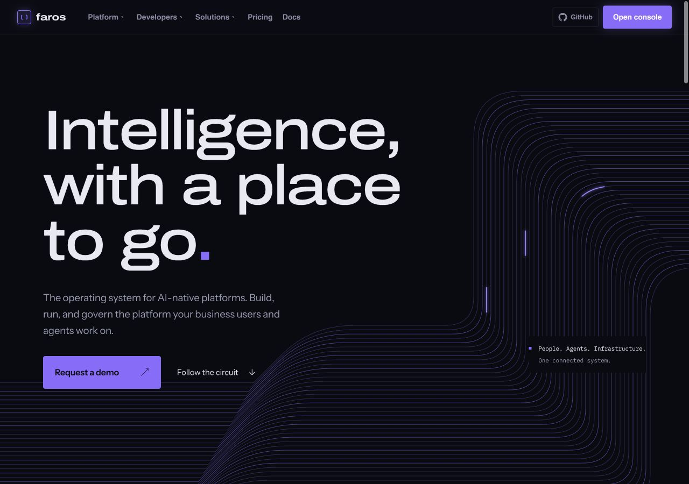

# Violet Circuit design checkpoint

Saved on 2026-09-06 on branch `codex/violet-circuit-checkpoint`.

This is the approved visual direction to recall while exploring alternatives:
**Routed intelligence**. The homepage itself becomes the circuit through native
SVG conductors, oversized editorial typography, scroll-linked signals, and
capability routes that respond to hover and keyboard focus.

The user described this version as an awesome design and requested a separate
branch to preserve it. Earlier screenshot-led mockups are not part of this
checkpoint.

## Recall

Ask to return to the Violet Circuit checkpoint, or check out
`codex/violet-circuit-checkpoint`. Start new experiments on a separate branch
from this checkpoint to keep this version intact.

## Implementation and references

- Homepage: `layouts/partials/violet-circuit/`
- Route entry: `layouts/index.html`
- Design system record: `DESIGN.md`
- Product context: `PRODUCT.md`
- Surface brief: `.impeccable/surfaces/layouts-partials-violet-circuit-page-html.md`
- Local fonts and licenses: `static/fonts/violet-circuit/`
- Rendered references: `.impeccable/review/`

The build passed. Desktop/mobile, light-theme, reduced-motion, keyboard-focus,
and internal route checks were completed. Independent review returned ship for
the inspected scenes and reported browser checks. The design detector used a
limited regex fallback; this is not a comprehensive accessibility certification.
